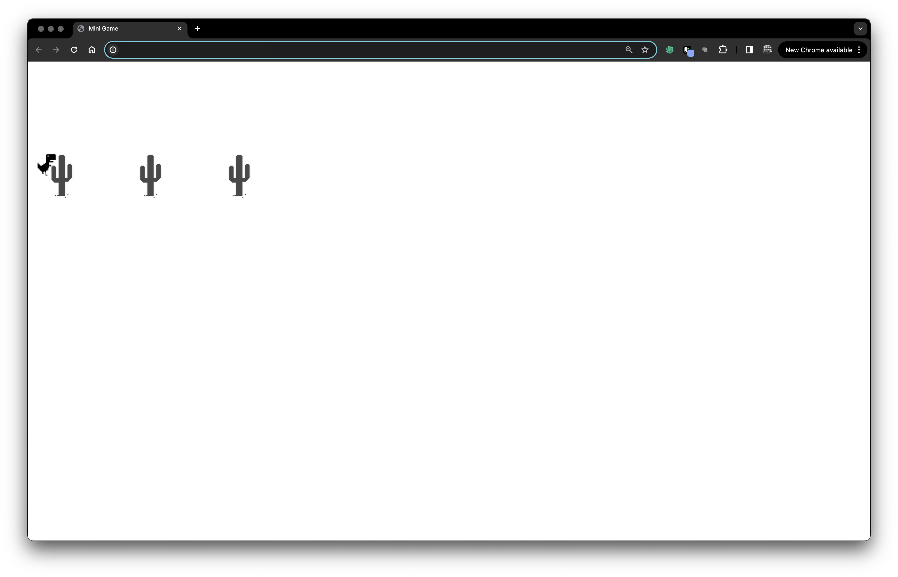

# 브라우저 공룡게임

웹 브라우저 기반의 공룡 게임으로, 플레이어는 키보드 조작으로 캐릭터를 제어하여 장애물을 피하도록 구현하였습니다.

# 목적

- **프로그래밍 실력 향상**: HTML, CSS, JavaScript를 사용하여 실제로 동작하는 게임을 만들어 봄으로써 웹 개발에 대한 이해를 깊게 하고, 프로그래밍 실력 향상을 위함
  
- **웹 개발 기술 시연**: 웹 표준 기술만을 사용하여 완전한 게임을 만들 수 있음을 보여주고, 이를 통해 브라우저의 기능 시연

## 기술 스택
`HTML5` `CSS3` `JavaScript`

